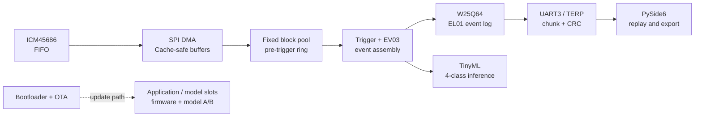
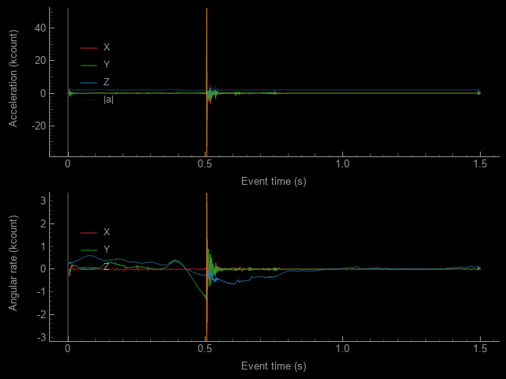
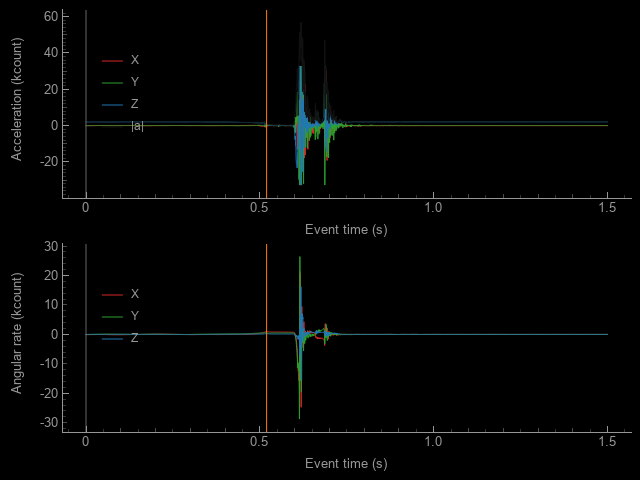
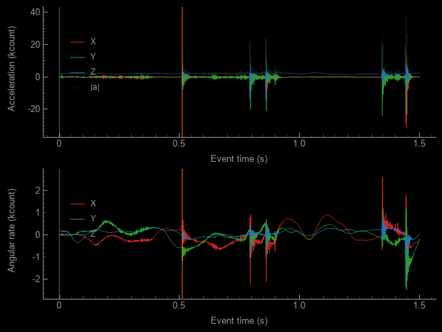

# 高动态运输事件记录器

> Embedded project: evidence-backed high-dynamic transport event recorder on STM32H743 + RT-Thread, with high-rate IMU capture, triggered SPI NOR persistence, versioned UART export, PySide6 replay, and on-device four-class TinyML.
>
> 嵌入式项目：基于 STM32H743 / RT-Thread 的高动态运输事件记录器，以 ICM45686 FIFO 完成高频采集，用 DMA 与固定内存池承接实时数据，经自然触发组装 EV03 并持久化到 W25Q64；通过 UART3 / TERP 导出，桌面端用 PySide6 回放，同时实现四分类 TinyML 推理与固件/模型 OTA 的软件核心链路（含模型 A/B 生命周期）。原有 V1 实板验证证据覆盖采集→触发→持久化→下载→回放→真实推理/WFI。

> **公开快照说明：** 本仓库由源仓库已提交 `main` 文件树重建，不包含原提交历史、分支、PR、标签或本机未提交改动；机器本地绝对路径已脱敏。项目源码、文档和验证数据按原快照保留。此次整理没有重新组装或复测硬件，文中验证状态只对应原有证据，不代表新增验证。

## 当前状态

| 维度 | 状态 |
|---|---|
| 发布基线 | `v1.0.0` released baseline；固定 EV03 事件（2400 samples；75 blocks，1.5 s）、持久化、TERP、桌面回放与四分类推理已形成 V1 主链 |
| 当前 `main` | V1-compatible reliability source；Reliability Evidence 默认关闭，不称为 V2.0 |
| 硬件链 | STM32H743 + ICM45686 + W25Q64 + UART3 |
| 软件栈 | RT-Thread / C11 / Python 3.12 / PySide6 / SCons |
| V1 实板主链 | 已闭环（V1 physical chain closed） |
| Reliability-enabled Release | `LOCKED`；仍需同一封板 revision 上 H0–H5 全部 physical-board PASS |

## 项目主链



术语速览：EV03 是固定采样事件格式，EL01 是承载并支持恢复的 SPI NOR 事件日志封装，TERP 是 UART3 的版本化传输协议；H0–H5 是 Reliability Evidence 的六项 physical hardware gates（实板硬件门禁）。

## 如何阅读这个项目

- 3–5 分钟：先看[当前概览与状态](#当前状态)，确认 V1 主链、发布边界和 Reliability-enabled Release 状态。
- 10–20 分钟：再看[系统架构与关键工程取舍](docs/showcase/architecture.md)，沿数据链核查采集、事件、持久化、传输与 OTA 的设计。
- 招聘者/面试官路线：最后按[招聘者与技术面试官阅读路线](docs/showcase/recruiter-walkthrough.md)进入源码、证据与限制；随后可继续到下方的真实运行证据、验证资源和[发布与证据入口](#发布与证据入口)。
- 深入链路：阅读[项目主链图谱（project main-chain atlas）](docs/learning/project-chain-atlas.md)，按“谁通知谁、数据在哪里、谁持有它、失败后去哪”核查。

## 工程亮点

| 方向 | 实现与可核查入口 |
|---|---|
| 高频采集 | ICM45686 FIFO + SPI DMA；Cortex-M7 Cache 边界由 D2 SRAM1 缓冲策略约束，ISR 只做最小完成通知。见 [DMA / Cache policy](docs/decisions/dma-cache-policy.md) 与 [`firmware/app/acquisition/`](firmware/app/acquisition/)。 |
| 确定性事件路径 | 固定 block pool、pre-trigger ring、明确 ownership 与 backpressure；资源不足时显式拒绝/计数，不静默覆盖受保护事件。见 [pre-trigger memory budget](docs/decisions/pretrigger-memory-budget.md) 与 [`firmware/app/event/`](firmware/app/event/)。 |
| 可恢复持久化 | 自然触发组装固定 EV03，W25Q64 以 EL01 追加式事件日志保存；CRC、readback 与启动恢复共同约束提交边界。见 [event log v1](docs/storage/event_log_v1.md)、[EV03 record format](docs/protocol/event_record_v3.md) 与 [`firmware/app/storage/`](firmware/app/storage/)。 |
| 协议与工具链 | TERP v1 版本兼容、分块下载与 CRC；同一链路提供 Host CLI、simulator 和 PySide6 desktop client。见 [TERP v1](docs/protocol/terp_v1.md)、[`protocol/`](protocol/)、[`host/transport_recorder/`](host/transport_recorder/) 与 [`host/transport_recorder/protocol/simulated_device.py`](host/transport_recorder/protocol/simulated_device.py)。 |
| TinyML 与模型生命周期 | 特征提取、四分类端侧推理、golden vectors、TRMD 模型包完整性校验与固件/模型 OTA lifecycle。见 [TinyML model contract](docs/ai/model_contract_v1.md)、[四分类 golden vectors](ai/tests/fixtures/ai_model_v1_four_class_golden_vectors.csv)、[`ai/src/export_model_package.py`](ai/src/export_model_package.py) 与 [`firmware/app/ota/`](firmware/app/ota/)。V1 的模型包是 CRC/SHA-256 完整性校验包，不把它描述为密码学签名或来源认证包。 |
| 升级与发布安全 | Bootloader 边界、构建身份、memory map、Release 镜像故障注入入口隔离（FaultInjection absence）和显式 Release gate 分开验证。见 [`bootloader/`](bootloader/)、[`config/memory_layout.yaml`](config/memory_layout.yaml)、[`scripts/check_fault_injection_absent.ps1`](scripts/check_fault_injection_absent.ps1) 与 [`scripts/release_gate.ps1`](scripts/release_gate.ps1)。 |

## 真实运行证据

下面是已提交的 V1 桌面派生图：由现有 Host 解码器和 PySide6 `ReplayWidget.export_png` 离屏导出，用于展示事件回放，不是示波器原始测量值。图只展示波形形状，不建立事件语义的人工真值。逐图来源与 metadata 见 [desktop evidence README](evidence/releases/v1.0.0/desktop/README.md)。

<table>
  <tr>
    <td></td>
    <td></td>
    <td></td>
  </tr>
  <tr>
    <td align="center">事件 180 回放</td>
    <td align="center">事件 195 回放</td>
    <td align="center">事件 202 回放</td>
  </tr>
</table>

## 验证与资源

以下是 [`a454b4d4fa80ef23333212cc9a8201f10f663cdb` current-main default-off gate snapshot](docs/superpowers/reports/2026-08-29-reliability-evidence-closeout.md#current-main-default-off-gate-snapshot)：Reliability Evidence 默认关闭的 Release gate 结果。它们证明 V1 兼容的默认关闭构建通过软件门禁，不解锁 Reliability-enabled Release；这组数字也不等同于 `v1.0.0` 发布产物。

| 检查 | 结果 |
|---|---|
| scripts | `135 passed` |
| Host | `178 passed，1 skipped` |
| AI | `78 passed` |
| native C / Bootloader / ARM Release | `PASS` |
| Release 镜像故障注入入口隔离（FaultInjection absence） | `PASS` |
| Release ROM | `136,528 B / 1,664 KiB (8.01%)` |
| primary RAM | `271,396 B / 512 KiB (51.76%)` |
| D2 SRAM1 | `2,144 B / 128 KiB (1.64%)` |

## 快速开始

本地环境与测试（`selfcheck` / `run_tests`）需要 PowerShell 7、Python 3.12、SCons、ARM GCC + binutils、native GCC，以及一个 RT-Thread checkout，并设置 `RTT_ROOT`。

```powershell
pwsh scripts/selfcheck.ps1 -Mode HostOnly
pwsh scripts/run_tests.ps1
```

可选的 `release_gate` 需要上述完整 toolchain，并额外要求 clean worktree：

```powershell
pwsh scripts/release_gate.ps1 -DeviceSerial recorder-001
```

如果当前 worktree 没有复制 `.venv`，可在 PowerShell 会话中指向已有的共享环境；`<shared-venv-path>` 是占位符，必须替换成实际路径后再执行：

```powershell
$env:TRANSPORT_VENV_ROOT = '<shared-venv-path>'
```

## 仓库导航

| 路径 | 用途 |
|---|---|
| [`firmware/`](firmware/) | STM32H743 / RT-Thread C11 固件、采集、事件、存储、协议、AI、OTA |
| [`host/`](host/) | Python Host、TERP client、simulator、事件解析与 PySide6 回放 |
| [`ai/`](ai/) | 数据契约、训练/评估、四分类模型导出与 golden vectors |
| [`protocol/`](protocol/) | TERP 消息定义、生成器与协议 golden files |
| [`scripts/`](scripts/) | selfcheck、测试、构建、Release gate 与证据工具 |
| [`evidence/`](evidence/) | V1 公开证据包与硬件/软件验证记录 |
| [`docs/`](docs/) | 设计决策、协议/存储/AI 契约、发布说明与可靠性收口 |

## 版本边界与诚实声明

- `v1.0.0` 是已发布、可回退的 V1 baseline；当前 `main` 是其后的开发基线，Reliability Evidence source 已实现但默认关闭，不是 V2.0。
- V1 的 firmware、protocol 与 model bytes 保持不变；该边界可追溯至 [V1.0.0 公开证据包](evidence/releases/v1.0.0/README.md) 与 [V1.0.0 release notes](docs/v1.0.0-release-notes.md)。
- Reliability-enabled Release 仍为 `LOCKED`：在同一封板 source revision 上完成 H0–H5 的 physical-board PASS 之前，native、Host、AI、Bootloader、ARM Release 和补充实板记录都不构成解锁依据。
- 四分类模型来自受控真实数据 pilot：test 为 `10/13`，macro-F1 为 `0.755952`；该结果证明链路可运行，不证明独立 session 或所有运输场景的泛化准确率。
- 不宣称已经完成 72 小时长稳或 100 次实板断电验证；这些不属于当前 V1 已完成的实板证据范围。

## 发布与证据入口

- [V1.0.0 公开证据包](evidence/releases/v1.0.0/README.md)：能力结论、限制、provenance、manifest 与桌面派生图。
- [V1.0.0 release notes](docs/v1.0.0-release-notes.md)：发布能力、AI 结果边界、明确未声明项与构建身份。
- [Reliability Evidence final closeout](docs/superpowers/reports/2026-08-29-reliability-evidence-closeout.md)：默认关闭状态、H0–H5 证据边界与 Reliability-enabled Release 锁定规则。
- [项目主链图谱（project main-chain atlas）](docs/learning/project-chain-atlas.md)：从硬件采集到可恢复事件记录的源码与数据持有关系。
