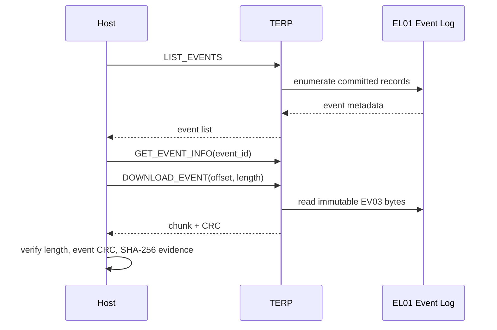

# 系统架构与关键工程取舍

本文从实时采集到主机取证描述系统的稳定边界。EV03（Event Version 03）是固定采样事件
记录，EL01（Event Log format 01）是包住内层事件、支持掉电恢复的 SPI NOR 追加日志，
TERP（Transport Event Recorder Protocol）是 UART3 上的版本化二进制协议。三者分层，
因此存储恢复和传输分块都不改变 EV03 的原始字节。

## 1. 端到端数据链

设备以 ICM45686 FIFO 作为采样入口。1.6 kHz 的样本先进入 SPI DMA 的 cache-safe 缓冲，
再由采集服务解析成固定大小的 `sample_block_t`。自然触发把 pre-trigger 环形窗口和
post-trigger 窗口组装成一次固定事件；事件同时进入 U2 W25Q64 的 EL01 持久化路径和可选
的四分类 TinyML 路径。主机只从已提交记录读取，不观察正在写入的 Flash 区域。

```mermaid
flowchart LR
    IMU["ICM45686 FIFO<br/>1.6 kHz"] --> DMA["SPI DMA<br/>cache-safe buffer"]
    DMA --> DONE{"DMA transfer<br/>complete"}
    DONE --> ISR["ISR<br/>acknowledge + notify only"]
    ISR --> ACQ["Acquisition task<br/>parse + sequence"]
    ACQ --> OWN["Ownership transfer<br/>producer to consumer"]
    OWN --> POOL["Fixed sample_block_pool<br/>192 blocks; 8 reserved"]
    POOL --> PRE["Pretrigger ring<br/>owned/reference-held blocks"]
    PRE --> TRIG{"Impact/drop<br/>trigger"}
    TRIG --> ADMIT["One-shot admission<br/>then cooldown"]
    ADMIT --> POST["Post-trigger<br/>block collection"]
    PRE --> ASM["Event assembly<br/>25 pre + 50 post blocks"]
    POST --> ASM
    ASM --> SNAP["In-memory event snapshot<br/>sample blocks"]
    SNAP --> AIQ["AI queue<br/>features from samples"]
    ASM --> LOSS["EV03 loss accounting<br/>sequence gaps + DATA_LOSS"]
    LOSS --> SERIAL["EV03 serialization<br/>header + samples"]
    SERIAL --> EV03["Immutable EV03<br/>bytes"]
    EV03 --> EL01["EL01 append transaction<br/>U2 W25Q64"]
    EL01 --> COMMIT["Committed event records"]
    COMMIT --> TERP["UART3 / TERP<br/>LIST + INFO + chunks"]
    TERP --> HOST["Host client<br/>CRC + replay + evidence"]
    AIQ --> AI["TinyML inference<br/>four classes"]
    AI --> SIDE["AI result sidecar<br/>QSPI, keyed by event_id"]
    SIDE --> TERP
    POOL -. pressure .-> REJECT["Explicit reject/degrade<br/>counter; protect retained events"]
```

图中的边界是所有权边界：DMA/ISR 只完成并通知缓冲，任务才转移缓冲所有权；固定池和
固定窗口把内存上限写进设计；压力必须显式拒绝或降级并计数，不能静默覆盖受保护事件。
AI sidecar 是事件之外的可选结果，不回写或改写 EV03。

## 2. RT-Thread 任务与中断边界

`app_runtime_start()` 负责把服务接到 RT-Thread 运行时：初始化 health、启动 UART3/TERP，
按编译开关启动 AI，再启动 storage、acquisition 和 event 服务，最后创建周期性
`sysreport` 线程。这里的名称只确认了 `sysreport`；采集、事件、存储和传输的执行上下文
以各模块服务接口为准，不把未由入口文件确认的线程名写成协议。

- 高频中断只应确认外设状态、完成 DMA 事件并唤醒消费者；解析、触发判定、Flash 编程和
  协议组帧均在任务/服务边界完成。
- UART3 RX 回调执行 `power_runtime_record_wake(POWER_WAKE_UART)` 做唤醒归因并释放信号量；
  回调不解析帧。低优先级线程读取原始字节、驱动 1 秒帧超时解析器并调用 `terp_service`。
  TERP service 通过 storage 读取已提交 EL01，不触摸 UART 寄存器或 Flash 内部格式。
- `runtime_health_evaluate` 聚合 acquisition、event 和 storage 输入，不把 AI 计数器纳入该
  健康输入；`print_imu_health_report` 的诊断输出单独暴露 AI 计数器。`sysreport` 每秒评估
  一次，并周期输出系统和采集健康信息。`POWER_MODE_FAULT_FALLBACK` 只用于 power、acquisition、
  event 或 reporter 的实际失败路径；TERP/storage 启动失败只记录错误并使相应功能不可用或降级，
  AI 启动失败记录 `fallback active`，这些分支本身不宣称切换到同一 power mode。
- 任务拥有已转移的块；事件服务持有的块在 Flash 写入或事件释放前不能回到 pre-trigger
  生产者。这个规则将 ISR 延迟和存储延迟隔离开。

## 3. DMA、Cache 与缓冲区所有权

DMA 缓冲使用 `TRANSPORT_DMA_BUFFER`，放在 D2 SRAM1 的 `0x30000000` 区域并按 Cortex-M7
32-byte cache line 对齐；DTCM 不用于 DMA。当前策略在打开 I/D Cache 前把整个 128 KiB
D2 SRAM1 映射为 non-cacheable、shareable、execute-never，优先保证设备访问的一致性。

如果后续需要 cacheable DMA 缓冲，CPU 写给 DMA 前必须 clean，DMA 写回 CPU 前必须
invalidate；两个范围都要向外扩展到 32-byte 边界。该规则是设备访问协议的一部分，不能
用“偶尔读到正确值”代替维护。

解析后的事件块位于 AXI RAM；D2 SRAM1 保留给 DMA/non-cacheable 缓冲，不承担长期事件
缓存。`sample_block_pool` 固定为 192 个块，采集交接预留 8 个块，事件保留必须在剩余
数量跌破预留之前停止。所有权、引用和计数器共同表达背压，避免环形队列在事件仍受保护
时复用同一块内存。

## 4. 预触发、事件组装与 EV03

V1 publisher 每个块固定发布 32 个样本；每块覆盖 20 ms。自然 impact/drop 触发为一次性
admission，事件固定保留 25 个 pre-trigger 块和 50 个 post-trigger 块，即 75 块、2400
样本、1.5 秒，随后进入 30 秒 cooldown。更长的物理 episode 不拆成 V1 的多个记录。

触发边界也固定：`trigger_sequence` 和 `trigger_monotonic_us` 指真正越阈值的样本，
`pretrigger_samples` 不含该样本，`posttrigger_samples` 从该样本计数，所以解析后的触发
索引等于 `pretrigger_samples`。EV03 头为 160 bytes，每个样本 16 bytes，当前内层长度为
`160 + 75 * 32 * 16 = 38560` bytes。

EV03 在固定头扩展中记录 `lost_sample_count`、首末丢失序号、缺口段数和时间范围；无缺失时这些值为零且
`DATA_LOSS` 清零。相邻块以 `current.sequence - (previous.sequence + previous.sample_count)` 计算 32-bit 缺口。
事件质量的配置阈值是 `EVENT_MAX_BLOCK_COUNT * SAMPLE_BLOCK_SAMPLE_CAPACITY = 100 * 64 = 6400` samples；
它只是缺口接受/拒绝的上限，不是 V1 的持久化形状。V1 已持久化/导出的固定形状仍是 `75 * 32 = 2400` samples；
超过 6400 samples 的差值按乱序/损坏拒绝。

当池中少于 8 个空闲块时，事件保留停止，释放活动事件并递增 resource-reject 计数；
已保留事件不被覆盖。此处的显式退化使丢样可见，也让后续 EV03 语义能够区分“记录中有
缺口”和“记录本身损坏”。

## 5. W25Q64、EL01 与恢复策略

U2 的 SPI2 W25Q64 是事件证据介质，默认识别为 8 MiB、4 KiB 擦除器件；JEDEC ID 或几何
参数不符时拒绝挂载。U3 QSPI 留给 OTA、模型和 AI sidecar，MCU 内部 Flash 不保存事件日志。

EL01 在 4 KiB 边界追加记录：32-byte 记录头、完整 EV03 字节、16-byte 尾和擦除态填充。
写入顺序为写头、流式写 EV03 并计算 CRC、补写头 CRC、写尾字段，最后单独把尾部
`commit_marker` 从 `0xFFFFFFFF` 编程为 `0x00000000`。只有最后一步成功，记录才可见。

超级块 A/B 是两个 4 KiB 检查点副本；每 16 条已提交事件更新一次较旧副本，写入、回读并
提交后才推进书签。它是恢复加速的书签，不是事件内容的唯一来源。

启动时选择有效且 generation 更新的超级块，再只读扫描后续 EL01；逐项验证范围、头 CRC、
尾魔数、提交标记、外层 CRC、EV03 格式/CRC 和事件 ID。遇到未提交或损坏记录就停止接受
其后内容，恢复只重建 RAM 写指针和下一 ID，不写 Flash；A/B 都失效时从数据区起始位置
扫描。运行中写失败会取消未提交记录并重新挂载，失败则保持不可写并告警。

V1 不循环覆盖、不自动删除，也没有安全的垃圾回收；空间不足进入 `FULL`，旧记录保持
不变。同步写入和检查点会牺牲写入吞吐，却把断电后的提交边界做成可审计状态。

## 6. UART3/TERP 下载链

TERP v1 使用 little-endian 帧：`TR` sync、版本 1、20-byte header、header CRC、payload
和 payload CRC。payload 上限为 4096 bytes；`READ_EVENT_CHUNK` 请求携带 event ID、offset
和长度，设备最多返回 4000-byte 数据块，以便容纳响应元数据。HELLO 协商必须成功后才能
执行其他请求；UART3 当前为 USART3、115200 8N1、无流控。

协议登记表中的 `LIST_EVENTS`、`GET_EVENT_INFO` 和 `READ_EVENT_CHUNK` 分别对应枚举、长度/
事件 CRC 查询和原始字节读取。下图用 `DOWNLOAD_EVENT` 表示主机的下载语义动作，它在
TERP v1 上落到 `READ_EVENT_CHUNK`，不会引入第二套帧解析器。

主机只在块 CRC 通过后追加 `.part` 文件；断线后重新 HELLO、复查事件信息，再从最后一个
完整块继续，完整事件 CRC 通过后才原子改名。SHA-256 在这里是证据完整性摘要，不是签名、
身份认证或来源证明；CRC 同样只发现意外损坏。

## 7. TinyML 推理与模型生命周期

AI 源码路径由 `TRANSPORT_AI_INFERENCE_ENABLED` 编译开关保护；但 canonical `firmware/app/SConscript` 在普通
app 构建中当前无条件加入 `-DTRANSPORT_AI_INFERENCE_ENABLED`，所以这不是对当前正常 app 构建“AI 默认关闭”的描述。
运行时选择经过验证的 runtime model，没有可用模型时回退到内置模型并明确记录 fallback；服务执行特征提取、四分类 int8 推理，统计提交、处理、队列丢弃、特征错误和 runtime 错误。

推理结果以 sidecar 形式独立持久化到 QSPI 的 AI result 区，按 `event_id` 关联事件；结果
包含模型版本、状态、类别、质量/事件标记、样本数、模型 CRC、confidence、logits、失败
原因和结果序号。sidecar 写入失败不会使已经提交的 EV03 失效，TERP 可分别报告事件原文和
AI 结果。

模型 OTA 以 begin、分块写、query、finalize/cancel 管理候选包；模型 A/B 槽以活动槽和
有效性状态切换。包和模型字节做 CRC/SHA-256 完整性校验，但这不是密码学签名；发布身份
和来源认证不能从这些校验中推导。

V1 受控真实数据的四分类结果为固定 split 64/14/13、int8 test 10/13、macro-F1
0.755952，且标记为 within-session pilot。这证明端到端真实推理链可运行，不等于独立
session 或所有运输场景的泛化准确率；指标与链路健康计数器应同时展示。

## 8. Bootloader、OTA 与回退

WFI（Wait For Interrupt）是 Cortex-M7 等待中断的低功耗指令；V1 使用普通 Sleep/WFI，
记录唤醒归因和 DMA、event、storage、AI、TERP、OTA blocker。它是运行时调度边界，不被
描述成已完成的 tickless、Standby 或电池续航验证。

内部 Flash 的固定边界来自 [`config/memory_layout.yaml`](../../config/memory_layout.yaml)：

| 区域 | 起始 | 大小 | 角色 |
|---|---:|---:|---|
| Bootloader | `0x08000000` | `0x00020000` | 启动、镜像选择 |
| Application | `0x08020000` | `0x001A0000` | RT-Thread 应用 |
| State primary/secondary | `0x081C0000` / `0x081E0000` | 各 `0x00020000` | OTA 状态双副本 |

QSPI 以 offset 管理候选固件、恢复包、AI result 和 model A/B；当前 model A 为
`0x00210000`、model B 为 `0x00508000`，各 `0x002F8000`，candidate/recovery 分别从
`0x00010000`/`0x00110000` 开始。这里的布局是地址契约，不把 QSPI 候选区当作事件日志。

应用启动后由 health 服务评估采集、事件和存储状态；OTA trial 只有在健康快照连续 30 秒
满足条件、并成功进入维护窗口后才调用 `ota_state_app_store_confirm_trial(0)`。未确认的
trial 保留为待处理状态，由 Bootloader/状态双副本的回退路径决定继续使用稳定应用还是
回到已知有效槽；确认和回退都不能破坏已发布的 V1 事件格式。

## 9. Reliability Evidence 旁路升级

H0-H5 是 Reliability Evidence 的六项 physical-board gates：它们把软件门禁、复位/看门狗、
采集丢样、U2 介质掉电、传输兼容和 QSPI/OTA/模型完整性等实板风险分开记录。它们不是把
native 或 Host 测试换一个名字。

- 默认构建写作 `reliability_evidence=0`；D3 SRAM4 overlay 只在显式启用该证据路径时
  条件加入，默认 Release 不占用这条旁路。
- FaultInjection 是 dedicated profile；普通 Release 不包含其入口。构建脚本也把它与
  Reliability Evidence source 分开，避免测试注入点进入发布镜像。
- TERP `0x0300`、`0x0301`、`0x0302` 是 additive IDs，分别承载事件证据、crash record
  分块读取和 crash record acknowledgement，不改写既有 TERP v1 事件读取 ID。
- enabled Release 仍为 `LOCKED`：只有同一 sealed source revision 上 H0-H5 全部取得
  physical-board PASS，才允许把旁路升级称为可发布版本。

可靠性收口报告的 [current-main default-off gate snapshot](../../docs/superpowers/reports/2026-08-29-reliability-evidence-closeout.md)
记录了默认关闭构建的边界和软件检查结果；它不是 `v1.0.0` Release artifact，也不是
Reliability-enabled Release。该报告明确保留未执行的物理子门禁，不从模拟、native 或
Host 结果推导实板结论。

## 10. 资源预算与工程边界

| 资源/边界 | 当前契约 | 工程含义 |
|---|---|---|
| 采集池 | 192 × 1,184 B，约 222.0 KiB | 固定内存；8 块为采集交接预留 |
| 事件形状 | 75 blocks / 2400 samples / 1.5 s | V1 不接受可变长度事件 |
| EV03 内层 | 38,560 B | 160-byte header + 16-byte samples |
| EL01 单条占用 | 40,960 B / 10 sectors | 4 KiB 对齐、头尾和擦除态填充 |
| U2 事件数据区 | 8,184 KiB | 约 204 条固定 V1 事件的理论容量 |
| DMA 区 | D2 SRAM1 128 KiB | non-cacheable、非长期事件缓存 |
| TERP payload/chunk | 4096 B / 4000 B | CRC 和响应元数据换取可恢复下载 |

这些数字描述布局和固定窗口，不是对每种物理负载的吞吐承诺。确定性换来的是较少的动态
分配和可预测的背压；代价是长 episode 只保留首个固定窗口。EL01 追加和双检查点换来
掉电可恢复提交边界；代价是同步写入、擦除和无回收时的空间放大。TERP 分块和幂等重读换
来断线恢复；代价是每块 CRC/元数据带来的吞吐开销。

本文也不把 CRC/SHA-256 说成签名，不把软件 gate 说成工业认证，不把未完成的长时间或
反复掉电实验说成已通过，也不把 default-off snapshot 说成完整 reliability release。
硬件门禁、功耗、长期稳定性和更广泛 AI 泛化均保留各自的验证边界。

## 11. 源码导航

从本页出发的固件数据路径：

- 采集与 DMA：[acquisition](../../firmware/app/acquisition/)、[pipeline](../../firmware/app/pipeline/)
- 事件组装与背压：[event](../../firmware/app/event/)
- 持久化与导出：[storage](../../firmware/app/storage/)、[transport](../../firmware/app/transport/)
- 可靠性旁路：[reliability](../../firmware/app/reliability/)
- Host 传输、下载与回放：[transport_recorder](../../host/transport_recorder/)
- AI 数据、模型和 golden vectors：[ai](../../ai/)
- 发布门禁：[release_gate.ps1](../../scripts/release_gate.ps1)

冻结的契约和证据入口：

- [TERP message registry](../../protocol/terp_messages.yaml)、[TERP v1](../protocol/terp_v1.md)
- [EV03 record format](../protocol/event_record_v3.md)、[EL01 event log](../storage/event_log_v1.md)
- [DMA/Cache policy](../decisions/dma-cache-policy.md)、[pre-trigger memory budget](../decisions/pretrigger-memory-budget.md)
- [V1.0.0 artifact/evidence package](../../evidence/releases/v1.0.0/README.md)、[V1.0.0 release notes](../v1.0.0-release-notes.md)
- [current-main default-off snapshot](../../docs/superpowers/reports/2026-08-29-reliability-evidence-closeout.md)、[memory layout](../../config/memory_layout.yaml)

阅读本页时，优先把 V1 fixed contracts、当前 main 的 default-off reliability snapshot 和
未来必须在封板 revision 上完成的 H0-H5 分开；这样源码导航、下载证据和 Release 标签不会
被混用。
