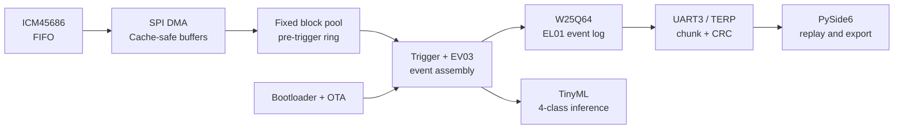
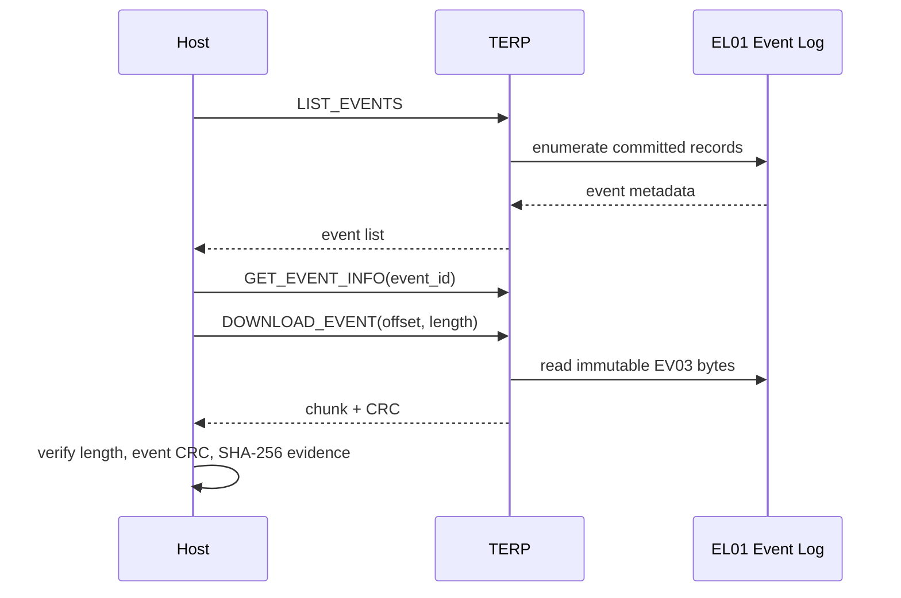

# Recruitment Showcase Implementation Plan

> **For agentic workers:** REQUIRED SUB-SKILL: Use superpowers:subagent-driven-development (recommended) or superpowers:executing-plans to implement this plan task-by-task. Steps use checkbox (`- [ ]`) syntax for tracking.

**Goal:** Turn the repository into an evidence-backed embedded firmware portfolio that a recruiter can understand in 3–5 minutes and a technical interviewer can audit in depth.

**Architecture:** Keep the root `README.md` as the concise entry point, move detailed system reasoning into `docs/showcase/architecture.md`, and provide role-based reading routes in `docs/showcase/recruiter-walkthrough.md`. Reuse committed V1 evidence and desktop plots in place; do not duplicate artifacts, alter runtime code, or broaden release claims.

**Tech Stack:** GitHub-flavored Markdown, Mermaid, existing PNG evidence, PowerShell, Python 3.12, pytest, Git.

---

## File map

- Modify `README.md`: bilingual summary, verified facts, system overview, engineering highlights, real screenshots, validation, version status, quick start, and navigation.
- Create `docs/showcase/architecture.md`: detailed data flow, task boundaries, ownership, persistence, protocol, AI, OTA, and reliability design.
- Create `docs/showcase/recruiter-walkthrough.md`: 3-minute recruiter route, 10-minute interviewer route, and deep technical audit route.
- Read only `docs/v1.0.0-release-notes.md`: authoritative V1 claims.
- Read only `evidence/releases/v1.0.0/README.md`: public hardware evidence boundary.
- Read only `docs/superpowers/reports/2026-08-29-reliability-evidence-closeout.md`: reliability status and release lock.
- Reuse `evidence/releases/v1.0.0/desktop/event-180.png`, `event-195.png`, and `event-202.png`: representative event-ID desktop-derived plots; they do not establish semantic ground truth.

### Task 1: Rewrite the root README as the recruiter landing page

**Files:**
- Modify: `README.md`
- Verify against: `docs/v1.0.0-release-notes.md`
- Verify against: `evidence/releases/v1.0.0/README.md`
- Verify against: `docs/superpowers/reports/2026-08-29-reliability-evidence-closeout.md`

- [ ] **Step 1: Replace the introduction with a bilingual evidence-first hero**

The first screen must contain this information, with compact prose rather than marketing slogans:

```markdown
# 高动态运输事件记录器

> Evidence-backed high-dynamic transport event recorder built on STM32H743 and RT-Thread. It captures high-rate IMU data, preserves triggered events in SPI NOR, exports them over a versioned UART protocol, replays them on a PySide6 desktop client, and runs a four-class TinyML model on-device.

面向高冲击、振动和运输异常追溯的嵌入式事件记录系统。项目已经完成从 ICM45686 采集、DMA 与固定内存池、自然触发、EV03 事件持久化，到 UART3/TERP 下载、桌面回放、端侧四分类推理和固件/模型 OTA 的 V1 实板闭环。
```

Immediately follow it with a compact status table containing:

```markdown
| 维度 | 当前结论 |
|---|---|
| 正式基线 | `v1.0.0`，已发布并保留为回退点 |
| 当前主线 | V1 兼容的可靠性增强源码，默认关闭 |
| 硬件平台 | STM32H743 + ICM45686 + W25Q64 + UART3 |
| 软件平台 | RT-Thread、C11、Python 3.12、PySide6、SCons |
| V1 实板链路 | 采集 → 触发 → 存储 → 下载 → 回放 → AI，已闭环 |
| Reliability Release | 仍锁定；不把部分硬件证据写成正式发布 PASS |
```

- [ ] **Step 2: Add a concise “项目主链” Mermaid diagram**

Use this GitHub-native structure and keep labels short enough to render on desktop and mobile:



- [ ] **Step 3: Add engineering highlights without duplicating the architecture page**

Use six short subsections or a two-column table covering:

- high-rate acquisition: FIFO, DMA, Cortex-M7 Cache boundaries, minimal ISR work;
- deterministic event path: fixed-size block pool, pre-trigger ring, explicit ownership/backpressure;
- recoverable persistence: EV03 immutable event bytes, EL01 append/recovery, CRC and readback;
- protocol and tooling: TERP v1 compatibility, chunked download, CLI/simulator/PySide6 desktop client;
- TinyML and lifecycle: feature extraction, four-class inference, golden vectors, CRC/SHA-256 integrity-checked model package (not a cryptographic signature), and OTA lifecycle;
- release safety: Bootloader boundary, build identity, memory map, fault-injection absence and explicit release gate.

Every paragraph must link to a stable repository path instead of claiming more detail inline.

- [ ] **Step 4: Add the real evidence gallery**

Use an HTML table so the three images stay aligned on GitHub:

```html
<table>
  <tr>
    <td></td>
    <td></td>
    <td></td>
  </tr>
  <tr>
    <td align="center">事件 180 回放</td>
    <td align="center">事件 195 回放</td>
    <td align="center">事件 202 回放</td>
  </tr>
</table>
```

Caption the gallery as committed V1 representative event-ID desktop-derived plots, not raw oscilloscope measurements; the plots show waveform shape and do not establish semantic ground truth.

- [ ] **Step 5: Add verification, version boundary, quick start, and navigation**

The verification section must include the latest default-off release-gate facts:

```markdown
- scripts：135 passed
- Host：178 passed，1 skipped
- AI：78 passed
- native C、Bootloader、ARM Release：PASS
- FaultInjection absence：PASS
- Release ROM：136,528 B / 1,664 KiB（8.01%）
- Release RAM：271,396 B / 512 KiB（51.76%）
```

Add explicit links to:

- `evidence/releases/v1.0.0/README.md`
- `docs/v1.0.0-release-notes.md`
- `docs/superpowers/reports/2026-08-29-reliability-evidence-closeout.md`
- `docs/showcase/architecture.md`
- `docs/showcase/recruiter-walkthrough.md`

Keep the quick start limited to:

```powershell
pwsh scripts/selfcheck.ps1 -Mode HostOnly
pwsh scripts/run_tests.ps1
pwsh scripts/release_gate.ps1 -DeviceSerial recorder-001
```

- [ ] **Step 6: Run README-focused checks**

Run:

```powershell
rg -n 'TBD|TODO|C:\\Users|72 小时.*通过|100 次.*通过|V2\.0|工业级认证' README.md
git diff --check -- README.md
```

Expected: no forbidden claim or local absolute path; the only allowed `V2.0` occurrence is an explicit “不称为 V2.0” boundary if retained; `git diff --check` exits 0.

- [ ] **Step 7: Commit the recruiter landing page**

```powershell
git add README.md
git commit -m "docs(readme): present embedded systems project"
```

### Task 2: Create the architecture deep dive

**Files:**
- Create: `docs/showcase/architecture.md`
- Read: `firmware/app/runtime/app_runtime.c`
- Read: `firmware/app/SConscript`
- Read: `protocol/terp_messages.yaml`
- Read: `config/memory_layout.yaml`

- [ ] **Step 1: Write the architecture page with explicit module boundaries**

Create the document with these complete sections:

```markdown
# 系统架构与关键工程取舍

## 1. 端到端数据链
## 2. RT-Thread 任务与中断边界
## 3. DMA、Cache 与缓冲区所有权
## 4. 预触发、事件组装与 EV03
## 5. W25Q64、EL01 与恢复策略
## 6. UART3/TERP 下载链
## 7. TinyML 推理与模型生命周期
## 8. Bootloader、OTA 与回退
## 9. Reliability Evidence 旁路升级
## 10. 资源预算与工程边界
## 11. 源码导航
```

Use one detailed Mermaid diagram to show runtime ownership and one sequence diagram to show event download:



State the ownership rule directly: ISR/DMA completes a buffer, task context transfers ownership, fixed pools provide bounded memory, and downstream backpressure must reject or degrade explicitly rather than silently overwrite data.

- [ ] **Step 2: Document reliability as a side path, not a V1 replacement**

Include these facts:

- `TRANSPORT_RELIABILITY_EVIDENCE_ENABLED` defaults to `0`;
- CrashRecord uses a conditional D3 SRAM4 overlay only when enabled;
- FaultInjection is limited to the dedicated profile and is rejected from ordinary builds;
- TERP reliability commands append IDs `0x0300`–`0x0302` without changing locked V1 payloads;
- Reliability-enabled Release remains locked until H0–H5 are all physical-board PASS for one sealed revision.

- [ ] **Step 3: Add exact source navigation**

Link each topic to directories or files that exist in the repository, including:

```markdown
- 采集：[`firmware/app/acquisition/`](../../firmware/app/acquisition/)
- 事件：[`firmware/app/event/`](../../firmware/app/event/)
- 存储：[`firmware/app/storage/`](../../firmware/app/storage/)
- 协议：[`firmware/app/transport/`](../../firmware/app/transport/)
- 可靠性：[`firmware/app/reliability/`](../../firmware/app/reliability/)
- Host：[`host/transport_recorder/`](../../host/transport_recorder/)
- AI：[`ai/`](../../ai/)
- 发布门：[`scripts/release_gate.ps1`](../../scripts/release_gate.ps1)
```

- [ ] **Step 4: Verify and commit the architecture page**

Run:

```powershell
git diff --check -- docs/showcase/architecture.md
rg -n 'TBD|TODO|C:\\Users' docs/showcase/architecture.md
```

Expected: no placeholders or absolute local paths; diff check exits 0.

Commit:

```powershell
git add docs/showcase/architecture.md
git commit -m "docs(showcase): explain system architecture"
```

### Task 3: Create recruiter and interviewer reading routes

**Files:**
- Create: `docs/showcase/recruiter-walkthrough.md`
- Read: `docs/learning/project-chain-atlas.md`
- Read: `docs/learning/高动态运输事件记录器_面试学习总纲.md` only if it is tracked in this worktree; otherwise do not import private material.

- [ ] **Step 1: Write three bounded reading paths**

Use this structure:

```markdown
# 招聘者与技术面试官阅读路线

## 3 分钟：确认项目是否真实、完整
1. 阅读 README 首屏和状态表。
2. 看端到端主链图。
3. 看三张真实事件回放图。
4. 打开 V1 公开证据包。

## 10 分钟：判断嵌入式工程深度
1. 检查 DMA/Cache 与固定内存所有权。
2. 检查 EV03/EL01 持久化和恢复。
3. 检查 TERP 下载、CRC 和旧客户端兼容。
4. 检查 Bootloader/OTA 与 Release gate。
5. 检查 Reliability 默认关闭和发布锁。

## 深度核查：从声明走到源码和证据
```

The deep route must map each public claim to one code path and one evidence/document path. It must not copy local-only notes from the dirty main worktree.

- [ ] **Step 2: Add embedded-firmware interview entry points**

Cover these questions with links rather than scripted perfect answers:

- 为什么使用 FIFO + DMA，Cache 如何处理？
- 为什么使用固定内存池，背压时怎样处理？
- 如何证明事件没有被静默截断或覆盖？
- 掉电恢复的提交顺序和 CRC 边界是什么？
- 旧 TERP 客户端为什么仍兼容？
- OTA 失败时如何回退？
- 哪些可靠性能力尚未取得正式实板发布资格？

- [ ] **Step 3: Verify and commit the walkthrough**

Run:

```powershell
git diff --check -- docs/showcase/recruiter-walkthrough.md
rg -n 'TBD|TODO|C:\\Users|保证绝对|工业级认证' docs/showcase/recruiter-walkthrough.md
```

Expected: no output from the forbidden-term scan and diff check exits 0.

Commit:

```powershell
git add docs/showcase/recruiter-walkthrough.md
git commit -m "docs(showcase): add recruiter reading routes"
```

### Task 4: Connect the three documents and validate every local link

**Files:**
- Modify: `README.md`
- Verify: `docs/showcase/architecture.md`
- Verify: `docs/showcase/recruiter-walkthrough.md`

- [ ] **Step 1: Add final cross-links to README**

Ensure the README contains direct relative links to both showcase pages under a “如何阅读这个项目” section. Keep the existing release and evidence links adjacent to them so a reader can move from overview to implementation to proof.

- [ ] **Step 2: Run a local Markdown link validator**

Run this PowerShell/Python command from the worktree root:

```powershell
$env:TRANSPORT_VENV_ROOT = '<shared-venv-path>'
# Replace <shared-venv-path> with the actual shared virtual-environment path before running.
@'
from pathlib import Path
import re
import sys

root = Path.cwd()
files = [root / "README.md", *sorted((root / "docs" / "showcase").glob("*.md"))]
missing = []
pattern = re.compile(r"!?\[[^\]]*\]\(([^)]+)\)|]*src=\"([^\"]+)\"")
for source in files:
    text = source.read_text(encoding="utf-8")
    for match in pattern.finditer(text):
        target = next(group for group in match.groups() if group)
        if target.startswith(("http://", "https://", "#", "mailto:")):
            continue
        clean = target.split("#", 1)[0]
        if not clean:
            continue
        resolved = (source.parent / clean).resolve()
        if not resolved.exists():
            missing.append(f"{source.relative_to(root)} -> {target}")
if missing:
    print("\n".join(missing))
    sys.exit(1)
print(f"showcase links: PASS ({len(files)} markdown files)")
'@ | & "$env:TRANSPORT_VENV_ROOT\Scripts\python.exe" -
```

Expected: `showcase links: PASS (3 markdown files)`.

- [ ] **Step 3: Run claim and formatting checks**

Run:

```powershell
rg -n 'TBD|TODO|C:\\Users|72 小时.*通过|100 次.*通过|工业级认证' README.md docs/showcase
git diff --check
```

Expected: no forbidden claims or local paths; diff check exits 0.

- [ ] **Step 4: Run the V1 compatibility contract**

Run:

```powershell
$env:TRANSPORT_VENV_ROOT = '<shared-venv-path>'
# Replace <shared-venv-path> with the actual shared virtual-environment path before running.
& "$env:TRANSPORT_VENV_ROOT\Scripts\python.exe" -m pytest host/tests/test_v1_compatibility_contract.py -q
```

Expected: `12 passed`.

- [ ] **Step 5: Commit final navigation corrections**

```powershell
git add README.md docs/showcase/architecture.md docs/showcase/recruiter-walkthrough.md
git commit -m "docs(showcase): connect portfolio evidence"
```

If Step 1 produced no file change, skip this commit instead of creating an empty commit.

### Task 5: Final review and GitHub-ready handoff

**Files:**
- Review: `README.md`
- Review: `docs/showcase/architecture.md`
- Review: `docs/showcase/recruiter-walkthrough.md`
- Review: `docs/superpowers/specs/2026-08-30-recruitment-showcase-design.md`

- [ ] **Step 1: Review the final diff against the approved spec**

Run:

```powershell
git diff main...HEAD --stat
git diff main...HEAD -- README.md docs/showcase docs/superpowers/specs/2026-08-30-recruitment-showcase-design.md
```

Confirm all design sections have a corresponding implementation and no firmware, Host, AI, protocol, evidence artifact, or build file changed.

- [ ] **Step 2: Verify repository state and commit history**

Run:

```powershell
git status --short
git log --oneline main..HEAD
```

Expected: clean worktree and a small sequence of documentation-only commits.

- [ ] **Step 3: Request final code/content review**

Review along two axes:

- standards: links, rendering, scannability, factual tone, repository conventions;
- specification: complete coverage of the approved information architecture and claim boundaries.

Any P0/P1 finding must be fixed before integration. The primary agent owns the final decision.

- [ ] **Step 4: Present integration choices**

After all checks pass, use the finishing-development-branch flow. Do not merge, push, delete the branch, or remove the worktree without explicit user authorization for that final operation.
