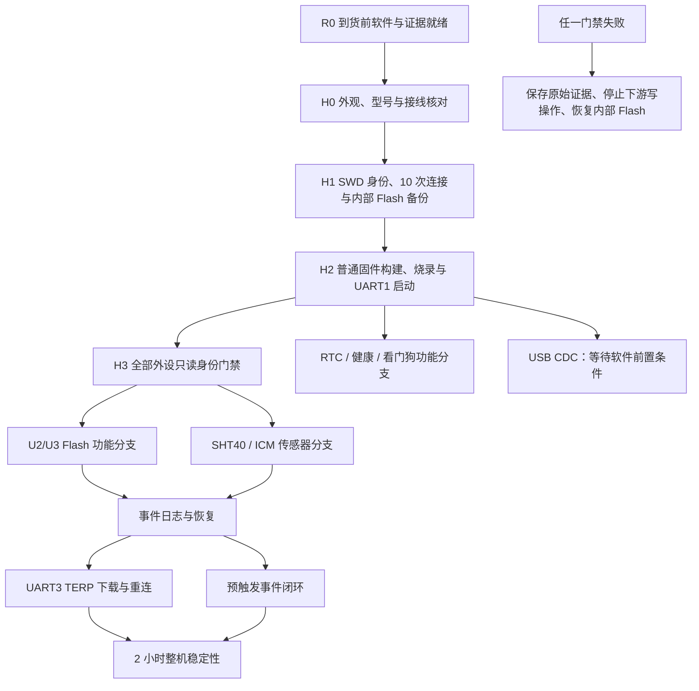

# STM32H743 + ICM-45686 + SHT40 到货硬件验证设计

状态：设计已审查；软件修复与历史证据进入集成，剩余硬件门禁见共同维护表
日期：2026-08-11
执行工作树：`feature/hardware-bringup`
状态总表：[`evidence/hardware-validation.md`](../../../evidence/hardware-validation.md)

## 1. 目的

本设计用于在只有 ST-Link 和 3.3 V USB-TTL、没有万用表、示波器或逻辑分析仪的条件下，对以下硬件执行可复现的功能验证：

- OpenMV4 风格 STM32H743VIT6 主板；
- 板载 U2 SPI W25Q64 和 U3 QSPI W25Q64；
- 外接 ICM-45686 / GY-601N1；
- 外接 SHT40；
- UART1 调试控制台和 UART3 TERP 通道；
- 依赖这些硬件的软件闭环：事件记录、下载、RTC/健康和长时间运行。

目标不是让所有项目看起来“完成”，而是让每个结论都能由真实原始日志、结果截图或 SWD 原始读回文件复核。只有满足验收条件并形成 A 级证据的项目，才允许在共同总表中标记 `🟢 已通过`。

本设计补充并收紧 2026-08-05 的 bring-up 设计。发生冲突时，以本设计的证据门禁、无仪器边界和安全停止条件为准。

## 2. 固定约束

### 2.1 可用设备

- ST-Link；
- STM32CubeProgrammer CLI；
- 3.3 V 逻辑 USB-TTL；
- Windows 主机；
- 主板正常 USB 供电/数据线；
- 仓库已有 Python 3.12、SCons、ARM GCC、pyserial 和主机 CLI。

普通 USB 线是板卡供电/数据连接件，不是测量仪器。USB-TTL 的 VCC 线始终不接；主板使用自身设计的 USB 输入供电。

### 2.2 明确不使用

- 万用表；
- 示波器；
- 逻辑分析仪；
- 可编程电源；
- 外部时钟计数器。

### 2.3 本设计不能证明的项目

以下内容不能由 ST-Link 或 USB-TTL 直接证明，不得写成 `PASS`：

- 5 V、3.3 V 和 VBAT 的电压精度；
- 电源轨对地阻值和短路裕量；
- SPI/I2C/UART 边沿、振铃、建立保持时间和信号完整性；
- HSE/LSE 的真实频率与抖动；
- 精确发生在 Flash 编程窗口中的可控掉电恢复。

对应的软件可观测功能仍可单独验收。例如 U2 完成 JEDEC、擦写、读回和重启保持后，可以把“U2 功能链路”标绿，但不能把“SPI 电气质量”一并标绿。

## 3. 设计原则

1. **证据先于测试。** 串口或 CubeProgrammer 日志采集必须在复位、烧录或长稳计时前启动。
2. **一次只改变一个变量。** 板卡断电后才换线；每轮只换一个固件模式或一个外设连接。
3. **先只读，后写入。** 身份、备份和测试区门禁未通过前，禁止 Flash 擦除或编程。
4. **失败立即停在当前层。** 低层失败不靠反复改时钟、模式或引脚猜测；保存证据后关闭下游门禁。
5. **诊断与普通运行隔离。** 每个诊断镜像具有唯一名称、构建参数和 SHA-256；不能依赖同名 `transport_recorder.bin` 判断烧入了哪一版。
6. **结果双通道。** 诊断结果优先输出到 UART3 原始日志，同时镜像到 D2 non-cacheable SRAM 供 SWD 读取。
7. **工作树预合并验证与 `main` 结论分层。** 硬件改动可以、也应当先在其所属的专用工作树完成实板验证，再进入合并流程；每次上板前仍必须记录 `git rev-parse main`、被测 `HEAD`、分支和 `git status --short`。工作树证据必须放入独立日期目录，并明确标注“工作树预合并”，可用于修复配置和决定是否合并，但不得直接改写为 `main` 的绿色结论。合并后必须在合并提交上至少重建、重烧并复核受影响的关键子门；共同总表同时保留工作树状态和 `main` 集成状态。与硬件无关的用户文件必须原样保留并在 preflight 中列出。
8. **范围和工作树隔离。** `feature/hardware-bringup` 只验证传感器、Flash、普通固件和通用硬件门禁；Bootloader/OTA 只能在专用工作树执行，不能因为兄弟工作树的结果改变本表状态。
9. **先确认板上映像，再允许烧录或归因。** 每轮上板先用 SWD 只读保存整片内部 Flash 备份和 SHA-256，并记录 ST-Link、MCU、供电和连接日志。若当前哈希不等于预期被测映像或已登记的安全恢复基线，必须把当前板卡标为“映像身份待确认”，不得把其串口、传感器或 Flash 输出归因于目标 `main`，也不得直接覆盖；只有备份可恢复且目标映像/恢复动作得到明确确认后，才可继续。

## 4. 验证架构



U2 失败只阻断事件存储、事件下载和依赖 U2 的稳定性门禁；它不阻断 U3、SHT40 或 ICM 的独立验证。

## 5. A 级证据合同

### 5.1 目录结构

每次上板建立独立会话目录：

```text
evidence/hardware-bringup/YYYY-MM-DD/SESSION_ID/
├── metadata.json
├── git-status.txt
├── source-diff.patch
├── tool-versions.log
├── firmware/
│   ├── normal/
│   ├── flash-identity/
│   ├── flash-functional/
│   ├── sensor-identity/
│   ├── sht40-long-run/
│   ├── icm-fifo-dma/
│   └── icm-long-run/
├── logs/
├── swd/
├── screenshots/
├── results/
│   └── gate-results.json
├── summary.md
└── SHA256SUMS.txt
```

`session-id` 使用本地时间和板卡短标识，例如 `20260812-093000-h743-01`。原厂 2 MiB 内部 Flash 备份可能包含厂商二进制，不提交仓库；`metadata.json` 必须记录其外部绝对路径、大小和 SHA-256。

### 5.2 元数据

`metadata.json` 必须包含：

- 会话开始/结束时间和时区；
- 测试人；
- 主板正反面标识、PCB 版本、MCU 丝印；
- ST-Link 序列号和固件版本；
- USB-TTL 型号、Windows COM 口、115200 8N1；
- `git rev-parse HEAD`、当前分支、`git status --short`；
- `git rev-parse main`、被测提交是否为该 `main` 的祖先，以及基线门禁结论；
- 是否存在未提交改动；
- 每个固件的构建参数、ELF/BIN 大小和 SHA-256；
- 板卡供电方式和每轮接线；
- 每个 Gate 的开始/结束时间、结果和证据路径。

### 5.3 原始证据规则

- CubeProgrammer 每个命令都使用真实 `-log` 文件或由 PowerShell 原样 `Tee-Object` 保存 stdout/stderr。
- 串口文件在打开端口后立即写入 ISO-8601 时间、COM 口和配置；随后原样追加接收字节。
- 原始日志禁止手工编辑。解析结果另写入 `results/*.json`。
- 长稳日志至少包含 `START`、每 60 秒一个 `PROGRESS`、最终 `RESULT`。
- SWD 结果块必须从当前 ELF 查符号地址，不得复制旧报告中的固定地址。
- 截图只能作为补充或在工具确实没有可导出日志时作为主证据；截图必须包含完整结果、时间和窗口来源。
- `SHA256SUMS.txt` 覆盖所有固件、日志、SWD 转储、截图和结果文件。

### 5.4 状态更新

| 条件 | 总表状态 |
|---|---|
| 实板达到条件，A 级证据存在、可打开且哈希已记录 | 🟢 已通过 |
| 实板做过且结果看起来正确，但只有人工抄录或 Markdown | 🟡 已执行 / 证据不足 |
| 只完成链路的一部分 | 🟠 部分完成 |
| 实板结果不满足条件 | 🔴 未通过 |
| 未执行或被前置门禁阻断 | ⚪ 未完成 |

## 6. 到货前强制就绪门禁 R0

R0 必须在连接新硬件前完成。当前仓库尚未具备完整自动采证能力，因此不能跳过此门禁直接上板。

### 6.1 现有可用入口

```powershell
pwsh scripts/selfcheck.ps1 -Mode Full
pwsh scripts/run_tests.ps1
pwsh scripts/build_firmware.ps1 -RequireElf
Get-FileHash firmware/build/transport_recorder.bin -Algorithm SHA256
pwsh scripts/program_firmware.ps1 -List
pwsh scripts/program_firmware.ps1 -Program
```

`program_firmware.ps1 -Program` 会重新构建普通镜像，只能烧普通固件；它不能用来烧已经构建好的诊断镜像。

### 6.2 上板前必须补齐的自动化

实现一个会话编排器 `scripts/hardware_validation.ps1`，提供以下动作：

- `Preflight`：检查工具、工作树、端口占用和证据目录；拒绝未合入 `main` 的提交，并把被拒绝的提交/差异写入证据；
- `BuildDiagnostic`：清理或隔离构建目录，按模式构建，将 ELF/BIN/MAP 复制到会话目录并计算哈希；
- `ProgramArtifact`：只烧指定哈希的 BIN，不隐式重建，保存 CubeProgrammer 原始日志；
- `BackupInternalFlash`：上传完整 2 MiB 内部 Flash，计算哈希并记录外部保存位置；
- `ReadResult`：用当前 ELF 符号表定位结果块，轮询完成标志，保存 `nm` 输出、SWD 原始读取和解码 JSON；
- `RestoreInternalFlash`：恢复会话前镜像，回读并比较 SHA-256；
- `RunFinshLoop`：在 UART1 上执行固定命令序列和 100 次事件循环，保存逐条命令、响应和退出状态；
- `RunTerpReconnect`：在 UART3 上执行 TERP 命令和 20 次断连续传，保存 stdout、stderr、退出码和文件哈希；
- `Finalize`：生成全目录哈希清单和 Gate 汇总，但不自动把失败项改成通过。

实现 `host/tools/capture_hardware_serial.py`：

- 显式指定 COM 口、波特率、时长和输出路径；
- 先打开日志，再提示用户复位；
- 同时保存原始字节文件和带时间戳的文本文件；
- 支持等待 `HV1 RESULT` 后退出；
- 串口断开、解码错误和超时都写入日志并返回非零。

### 6.3 固件诊断输出协议

所有硬件诊断统一输出单行 ASCII JSON：

```text
HV1 START {...}
HV1 PROGRESS {...}
HV1 RESULT {...}
```

每条至少包含 `schema`、`mode`、`firmware_sha256`、`elapsed_seconds` 和当前错误计数。长稳每 60 秒输出一次 `PROGRESS`，最终 `RESULT` 同时设置 D2 SRAM 的 `completed=1`。

当前一次性传感器和 Flash 诊断已经向 UART3 输出文本，但长稳和 FIFO/DMA 诊断只更新 SRAM；R0 必须把它们接入上述协议。ICM 结果还必须补充 `pool_backpressure_count` 和 `published_block_count`。

### 6.4 构建隔离

现有诊断构建参数包括：

```powershell
. .\scripts\project_env.ps1
& $SConsExe -C firmware -j4 -Q board_sensor_diagnostic=1
& $SConsExe -C firmware -j4 -Q board_sht40_long_run_diagnostic=1
& $SConsExe -C firmware -j4 -Q board_icm_fifo_probe_diagnostic=1
& $SConsExe -C firmware -j4 -Q board_icm_long_run_diagnostic=1
& $SConsExe -C firmware -j4 -Q board_flash_diagnostic=1
```

这些模式目前会覆盖同一组 `firmware/build/transport_recorder.*`。会话编排器必须在下一次构建前完成复制、命名和哈希；禁止通过文件修改时间猜测镜像身份。

### 6.5 Flash 只读模式

现有 `board_flash_diagnostic=1` 在身份通过且末尾扇区为空时会进入擦写流程，不能承担“只读身份门禁”。R0 必须增加明确的只读构建模式：

- 只初始化 U2/U3；
- 只执行 `0x9F` JEDEC 和状态寄存器读取；
- 不发送写使能、擦除或编程命令；
- U2 和 U3 可单独选择，禁止一次镜像隐式测试两个器件。

R0 的软件验收条件：

- 原生测试和板级契约测试通过；
- 所有普通/诊断镜像无警告构建；
- 串口采集器能用模拟串口保存 `START/PROGRESS/RESULT`；
- SWD 结果解析器能从 ELF 符号表定位模拟结果块；
- 证据目录和哈希清单能在无硬件模式下生成；
- `git diff --check` 通过。

## 7. 接线合同

所有换线均在主板、ST-Link 和 USB-TTL 与主机断开后进行。USB-TTL 的 VCC 不接，只接 TX、RX、GND。

### 7.1 UART1 控制台

| 主板 | USB-TTL | 说明 |
|---|---|---|
| PA9 / USART1_TX | RX | 板端发送 |
| PA10 / USART1_RX | TX | 主机命令 |
| GND | GND | 必须共地 |

UART1 用于 RT-Thread/FinSH 文本、`sysinfo`、`event` 和 `log` 命令。

### 7.2 UART3 诊断与 TERP

| 主板 | USB-TTL | 说明 |
|---|---|---|
| PD8 / USART3_TX | RX | 诊断文本或 TERP 响应 |
| PD9 / USART3_RX | TX | TERP 请求 |
| GND | GND | 必须共地 |

一次性硬件诊断和 TERP 都使用 UART3。普通固件运行 TERP 时，禁止用文本串口助手向 UART3 发送字符。只有一个 USB-TTL 时，UART1 和 UART3 必须断电换线，不能同时观测。

### 7.3 ICM-45686

| ICM-45686 | STM32H743 |
|---|---|
| VCC | 3V3 |
| GND | GND |
| SCLK | PA5 / SPI1_SCK |
| SDO / MISO | PA6 / SPI1_MISO |
| SDIO / MOSI | PA7 / SPI1_MOSI |
| nCS | PB0 |
| INT1 | PB1 |
| PS | 悬空，保持 raw SPI 模式 |

第一版线长保持尽可能短，模块和主板必须共地。

### 7.4 SHT40

| SHT40 | STM32H743 |
|---|---|
| VCC | 3V3 |
| GND | GND |
| SCL | PB8 / I2C1_SCL |
| SDA | PB9 / I2C1_SDA |

摄像头 FPC 必须断开；不得并联额外未知上拉。

## 8. 实板 Gate 设计

### H0：到货身份和外观

步骤：

1. 不上电，拍摄主板正面、背面、MCU 丝印、U2/U3 丝印、PCB 版本和各连接器。
2. 拍摄 ICM-45686 和 SHT40 正反面、模块丝印和排针。
3. 核对主板 MCU 为 `STM32H743VIT6`，模块为当前引脚合同对应型号。
4. 检查明显缺件、短接焊锡、弯针、金属碎屑、接口破损或烧蚀。

通过条件：

- 型号和 PCB 与资料一致；
- 无肉眼可见的装配危险；
- 照片保存在本次证据目录。

边界：H0 只表示“身份和外观通过”，不表示电源电气通过。

### H1：SWD 身份、稳定连接和内部 Flash 安全

前置：

- 不连接 ICM、SHT40 或 USB-TTL；
- 主板从自身 USB 输入供电；
- ST-Link 只按调试器和主板文档连接 SWDIO、SWCLK、GND、NRST及必要的目标电平参考，不用 ST-Link 3.3 V 脚给主板供电。

步骤：

1. 运行 `pwsh scripts/selfcheck.ps1 -Mode Full` 并保存日志。
2. 运行 `pwsh scripts/program_firmware.ps1 -List`，保存探针序列号。
3. 用 `port=SWD mode=UR reset=HWrst` 连续连接 10 次，每次单独记录退出码和完整 CubeProgrammer 日志。
4. 记录 Device ID、芯片名称、内部 Flash 大小和目标状态。
5. 在任何下载前上传 `0x08000000` 开始的完整 2 MiB 内部 Flash：

   ```powershell
   & $ProgrammerCli -c port=SWD -u 0x08000000 0x200000 $ExternalBackupPath -log $SessionLogPath
   ```

6. 记录文件大小和 SHA-256；再执行一次上传并比较两份哈希。

通过条件：

- 识别 Device ID `0x450`、STM32H743、2 MiB 内部 Flash；
- 10/10 次 SWD 连接成功；
- 两次 2 MiB 读回 SHA-256 一致；
- 原始 CubeProgrammer 日志和哈希均存在。

停止条件：

- 型号或容量不符；
- 10 次中任一次随机失败；
- 两次读回哈希不同；
- 设备异常发热、异味、冒烟或反复掉线。

H1 失败时禁止烧录。

### H2：普通固件构建、烧录和 UART1 启动

步骤：

1. 保存 `git status`、当前差异和工具版本。
2. 运行全套本地测试和普通固件构建。
3. 将 ELF/BIN/MAP 复制到会话目录并计算哈希。
4. 先连接 USB-TTL 到 UART1并启动串口原始日志，再使用 `program_firmware.ps1 -Program`。
5. 保存 CubeProgrammer 写入、校验和复位输出。
6. 执行 10 次软件复位和 10 次完整断电重启，每次确认启动横幅和应用启动状态。
7. 执行 `sysinfo`、`event status`、`log status` 和 `log inspect`，保存完整串口日志。

通过条件：

- 构建、写入和校验成功；
- 10/10 次复位和 10/10 次冷启动均出现完整启动；
- 没有意外 HardFault、看门狗循环、重复复位或 RT-Thread 内核线程栈溢出；
- UART1 的 `sysinfo`、`event status`、`log status` 和 `log inspect` 均有可关联的命令回显与响应；只看到启动横幅、只有发送记录或只有 `msh >` 提示符均不足以通过双向控制台；
- 每次启动日志和固件哈希可关联。

若 U2 尚未通过，`event log start failed` 可作为已知下游失败记录，但 H2 只验收 MCU、启动和控制台，不因此伪装 U2 通过。

若 H2 在 `main` 基线上出现启动失败、HardFault、assertion 或重复栈溢出，立即停止该基线的 H3、事件、TERP 和整机稳定性下游验证；只能继续做不依赖应用启动的只读 SWD/身份核对和恢复安全性检查。不得为了“补齐绿色项”而烧录未合入 `main` 的诊断镜像，除非另建独立工作树证据并明确不计入本表。

记录时允许拆分 H2 子门：镜像构建/烧录/校验可依据 CubeProgrammer 原始日志单独标绿；若通过当前 ELF 符号定位的 SWD 原始读取证明应用已走过规定启动阶段，也可单独标记“启动路径子门”；若只读 GPIO/USART 寄存器证明 PA9/PA10 复用和 USART1 配置正确，也只能标记外设配置子门。任何启动横幅后的栈溢出、UART1 启动横幅缺失、FinSH 固定命令无响应或规定的复位/冷启动次数缺失，都会使完整 H2 保持未闭合。

### H3：只读身份门禁

H3 使用 R0 新增的只读诊断镜像，不允许使用会自动写 Flash 的现有综合诊断。

#### H3-U2 / H3-U3

通过条件：

- `0x9F` 返回 `EF 40 17`；
- 状态寄存器读取成功；
- 日志中明确显示 `write_commands=0`；
- UART3 原始日志和 SWD 结果块一致。

U2 返回 `FF FF FF`、`00 00 00`、不稳定 ID 或超时时，立即标记 `🔴 未通过` 并关闭 U2 写入门禁。没有逻辑分析仪时不继续替换时钟、HAL 或启动文件猜测。

#### H3-ICM

连接 ICM 后运行一次性传感器诊断。通过条件：

- SPI 初始化、读取和 probe 结果均为 0；
- `WHO_AM_I(0x72)=0xE9`。

#### H3-SHT

连接 SHT40 后运行一次性传感器诊断。通过条件：

- `0x44` 和 `0x45` 中恰好一个地址应答；
- 当前模块预期地址为 `0x44`；
- 序列号两段 CRC 正确；
- 项目 probe/init/measure 均为 0；
- 温度位于传感器物理范围内，湿度位于 0–100 %RH。

传感器支路不依赖 U2。

### H4：U2/U3 有界 Flash 功能

每颗 Flash 单独构建和执行。不得让一个镜像同时推进两个器件的掉电状态机。

前置门禁：

- 对应 H3 JEDEC 已通过；
- H1 内部 Flash 备份和哈希已通过；
- 诊断固件哈希已保存；
- 选定测试扇区（默认 `0x007FF000..0x007FFFFF`）全为 `FF`。

若目标扇区不是全 `FF`，返回 `NON_ERASED_REFUSED` 并停止，不擦除已有数据。

若默认目标扇区因历史数据非空而触发 `NON_ERASED_REFUSED`，不得为了继续验证而擦除它。可在同一颗 Flash 上选择另一个 4 KiB 对齐、位于容量范围内的候选扇区，但必须先用只读命令保存该扇区完整原始备份和 SHA-256，并由原始数据证明候选扇区全为 `FF`。诊断镜像、UART3 行、SWD 结果块和最终报告都必须记录实际候选地址；默认非空扇区保持保护状态，不能因替代扇区通过而把默认目标门禁标绿。

**项目日志格式化的额外安全门禁：** 在执行 UART1 `log format --confirm` 前，必须核对实现和 U2 容量。当前 `event_log_format()` 的擦除范围是 `0..flash->capacity_bytes`，即整片 U2，而不是仅 `EVENT_LOG_DATA_OFFSET` 之后的日志区域。因此，只要 U2 存在未知或非空数据，`log format --confirm` 就视为整片破坏性擦除，禁止以“初始化日志”为由执行。只有在保存整片 U2 原始备份及 SHA-256、得到明确破坏性操作授权、并确认可恢复时，才可另立一次格式化验证；否则仅允许 `log status`、`log inspect`、`log list` 等只读命令，H7 保持未完成。

测试顺序：

1. 擦除目标 4 KiB 扇区；
2. 写入跨页、地址敏感测试图样；
3. 全量读回比较；
4. 保存 `AWAITING_POWER_CYCLE` 日志和 SWD 结果；
5. 断开主板 USB、ST-Link 和 USB-TTL 的主机端连接，等待 10 秒；
6. 重新供电并运行同一器件的第二阶段；
7. 验证掉电前图样；
8. 擦除测试扇区；
9. 全量确认最终为 `FF`；
10. 恢复会话前内部 Flash 并回读比较哈希。

通过条件：

- JEDEC 正确；
- `initial_sector_erased=1`；
- `program_readback_verified=1`；
- `power_cycle_pattern_verified=1`；
- `final_sector_erased=1`；
- `failure_offset` 无失败；
- 两阶段 CubeProgrammer 原始日志齐全；至少保存第一阶段 UART3 原始行和第二阶段的直接结果证据。第二阶段自动启动行若因监听时序丢失，可由已知结果块地址的 SWD 原始读取替代，但必须同时保存监听原始文件、SWD 原始日志、结果解析和最终测试扇区清理/恢复证据；不得用人工抄录或 Markdown 总结替代 SWD 原始日志。

这可以证明功能链路，但不证明 SPI/QSPI 信号裕量。

### H5：SHT40 30 分钟连续测量

运行 `board_sht40_long_run_diagnostic=1`，并使用改造后的 UART3 `HV1` 输出。

通过条件：

- 运行时长至少 1800 秒；
- attempts/writes/reads/success 均为 1800；
- I2C、转换和 CRC 错误为 0；
- `completed=1`；
- 每 60 秒 `PROGRESS` 连续存在；
- 最终 UART3 `RESULT`、SWD 结果块和解析 JSON 一致。

任何一分钟计数不增长、错误增加或意外复位都保留为失败，不从头重跑覆盖旧记录。

### H6：ICM-45686 FIFO、INT1、DMA 和 30 分钟采样

#### H6a 500 ms FIFO/DMA 探针

运行 `board_icm_fifo_probe_diagnostic=1`。通过条件：

- 启动和配置阶段完成；
- 1.6 kHz 加速度计/陀螺仪寄存器核对通过；
- FIFO count 大于 0 且不超过诊断缓冲容量；
- INT1 计数大于 0；
- DMA start=0、completion=0、callback count 大于 0；
- `completed=1`；
- UART3 和 SWD 原始证据齐全。

#### H6b 10 秒预检

在正式长稳前运行 10 秒完整采集链。所有 FIFO、解析、DMA、容量和 pool backpressure 错误必须为 0；否则禁止进入 30 分钟。

#### H6c 30 分钟长稳

绿色验收使用默认 1800 秒，不采用旧会话的 10 分钟结果。

通过条件：

- `completed=1`，运行时长至少 1800 秒；
- `sample_count` 接近 2,880,000，允许相对偏差不超过 0.5%；
- `service_count`、`INT1 IRQ count` 和 `published_block_count` 持续增长；
- FIFO count/read/parse/capacity 错误均为 0；
- DMA start/timeout/completion 错误均为 0；
- `pool_backpressure_count=0`；
- FIFO 最大深度不超过缓冲容量；
- 每 60 秒 `PROGRESS` 存在，最终 UART3 与 SWD 结果一致；
- 无意外复位。

### H7：U2 可靠事件日志和预触发闭环

前置：

- U2 H4 通过；
- ICM H6 通过；
- 普通固件已恢复并记录哈希。

UART1 控制台步骤：

1. `log status`、`log inspect`；
2. `event status`；
3. `event trigger_test`；
4. `event export`；
5. `log list`；
6. 使用 `log list` 返回的事件号执行 `log verify EVENT_ID_FROM_LIST`；
7. 软件复位后再次 `log inspect` 和 `log verify EVENT_ID_FROM_LIST`；
8. 连续执行 100 次受控 `trigger_test -> export -> verify`，记录每次事件 ID、CRC、资源计数和结果。

若 `log status` 显示 `UNFORMATTED`，不得直接跳到 `log format --confirm`；先按 H4 的整片擦除门禁停止并保存原始输出。当前软件格式化路径会擦除整颗 U2，不能把它当作无损的日志初始化步骤。

可增加轻柔桌面敲击作为实物触发，但禁止让裸板、模块或杜邦线自由落体。物理触发和命令触发分开记录。

通过条件：

- 所有测试事件可列出、读回和验证；
- 重启后恢复来源明确，事件仍有效；
- 100 次循环无资源泄漏、池耗尽、错误计数或复位；
- UART1 原始长日志和机器可读循环结果存在。

由于没有可编程电源，本设计只验证普通重启和人工完全断电后的持久性；“精确写入中掉电恢复”保持未完成。

### H8：UART3 TERP

断电后把唯一 USB-TTL 从 UART1 移到 UART3。普通固件上 UART3 是二进制 TERP 通道。

正确的主机命令顺序：

```powershell
& .\.venv\Scripts\python.exe -m pip install -e .
.\.venv\Scripts\transport-recorder.exe ports --json
.\.venv\Scripts\transport-recorder.exe info --port $ComPort --json
.\.venv\Scripts\transport-recorder.exe health --port $ComPort --json
.\.venv\Scripts\transport-recorder.exe time --port $ComPort --json get
.\.venv\Scripts\transport-recorder.exe events list --port $ComPort --json
.\.venv\Scripts\transport-recorder.exe events download --port $ComPort --id $EventId --output $SessionEventPath
```

执行时 `$ComPort`、`$EventId` 和 `$SessionEventPath` 由会话编排器从当前会话解析并写入日志，不由文档写死。

通过条件：

- 端口识别、HELLO、info、health、time、events list 全部返回成功 JSON；
- 下载文件的设备 CRC 校验通过，并保存 SHA-256；
- 20 次下载中物理断开/重新连接后，`.part`/manifest 能续传；
- 20 次最终文件完全一致；
- 每次命令 stdout、stderr、退出码和断连时间已保存。

若 U2 未通过，只能执行 HELLO/info/health，状态保持 `🟠 部分完成`，不能把 TERP 事件传输标绿。

### H9：RTC、系统健康和看门狗

前置条件：对应 RTC、健康状态和 IWDG 诊断入口必须已进入当前测试固件，并先通过软件测试与构建。缺少任一软件入口时，只将该子项标记为“软件前置条件未完成”，不得用手工观察代替。

这些项目只使用软件可观测结果：

- 通过 TERP 设置 UTC，再读取并与主机时间比较；
- 若板上已装有效 VBAT 电池，完全断开主电、ST-Link 和 USB-TTL 10 分钟后重新读取 RTC，验证时间继续前进；
- 使用专用诊断镜像故意停止喂狗，复位后保存 IWDG 复位原因；
- 板卡断电后断开 SHT40，再启动普通固件，确认系统进入降级而不是崩溃；
- 板卡断电后重新连接 SHT40，确认下一次启动恢复。

通过条件：

- RTC 设置/读取成功，断主电后时间单调并与预期间隔一致；
- 看门狗只在专用诊断中产生一次预期复位，复位原因可读；
- 传感器缺失产生明确健康状态，核心记录链路按设计降级。

若板上没有安装 VBAT 电池，RTC 保持项标记 `⚪ BLOCKED BY HARDWARE`，不标失败也不标绿。

### H10：USB CDC

当前仓库尚未实现 USB CDC 引脚、48 MHz、VID/PID 和枚举链，不能在到货当天直接执行。

软件前置条件完成后，仅用板载 USB 和 Windows 主机即可执行：

- 保存 `Get-PnpDevice`/设备管理器枚举结果和设备实例 ID；
- 20 次插拔枚举；
- 与 TERP 等价的 info/health/事件下载；
- 断开恢复和退出码记录。

在软件前置条件完成前，本项保持 `⚪ 未完成`。UART3 通过不能替代 USB CDC。

### H11：2 小时整机稳定性

前置：

- H2、H4-U2、H5、H6、H7 均通过；
- 普通固件恢复并记录哈希。

执行：

1. USB-TTL 连接 UART1，采集连续两小时系统、IMU、健康和事件日志；
2. 每分钟保存采样、FIFO、DMA、资源池、SHT40、事件和存储计数；
3. 起始和结束各执行一次 `sysinfo`、`event status`、`log status` 和 `log inspect`；
4. 结束后断电换线到 UART3，执行 TERP health、events list 和至少一次完整下载；
5. 校验事件 CRC 和主机文件 SHA-256。

通过条件：

- 两小时内无意外复位、HardFault 或任务停止；
- IMU/SHT40 计数持续增长；
- FIFO、DMA、CRC、Flash 和资源错误计数不增长；
- 事件在设备和主机两端可验证；
- 原始两小时日志完整，没有中间采集空洞。

## 9. 失败处理和重试限制

| 失败 | 处理 |
|---|---|
| SWD 识别失败或 10 次连接不稳定 | 保存全部日志，停止烧录；检查线序和 USB 供电后只允许一次有明确原因的复测 |
| 串口无输出 | 断电核对当前镜像使用 UART1 还是 UART3、TX/RX 是否交叉；先开日志再复位，只允许一次复测 |
| U2/U3 ID 无效 | 禁止写入；保存 UART/SWD/CubeProgrammer 证据，标红；没有仪器时停止底层猜测 |
| Flash 测试扇区非空 | 拒绝擦除；不格式化、不覆盖，记录 `NON_ERASED_REFUSED` |
| Flash 写入或读回失败 | 停止后续 Flash/事件/TERP，保存失败偏移；恢复内部 Flash |
| SHT40 任一 CRC/I2C 错误 | 当前长稳失败；保存原始日志，不删除失败后重跑 |
| ICM 解析/DMA/FIFO/backpressure 错误 | 当前 Gate 失败，禁止事件和整机长稳 |
| 诊断镜像身份或哈希不明 | 禁止烧录 |
| 原始日志未启动或丢失 | 本次不能标绿；可以保留“已执行/证据不足”，不得人工补造 |

同一失败不得连续盲目重跑。第二次尝试必须写明新的假设和唯一改变；仍失败则停止该 Gate。

## 10. 内部 Flash 恢复策略

1. H1 在任何写入前保存会话前完整 2 MiB 镜像和两次一致哈希。
2. 每个诊断镜像烧录前保存其固件哈希。
3. 诊断结束后默认恢复会话前镜像。
4. 恢复后重新上传 2 MiB，并与会话前 SHA-256 比较。
5. 若后续需要保留已验证的项目普通固件，必须作为独立、有记录的最终烧录动作执行；不能把它冒充为“恢复原镜像”。
6. U2/U3 外部 Flash 测试扇区必须在结束时恢复全 `FF`；任何未恢复状态都作为开放风险写入总表。

## 11. 到货当天推荐顺序

| 顺序 | Gate | 预计占用 | 是否可与其他项并行 |
|---:|---|---:|---|
| 1 | H0 外观和身份 | 15–30 分钟 | 否 |
| 2 | H1 SWD 和双读备份 | 30–45 分钟 | 否 |
| 3 | H2 构建、烧录、启动和重复复位 | 45–90 分钟 | 否 |
| 4 | H3 所有只读身份 | 30–60 分钟 | 按设备串行 |
| 5 | H4 U3、U2 有界 Flash | 每颗 30–60 分钟 | 分开执行 |
| 6 | H5 SHT40 30 分钟 | 约 35 分钟 | 与人工整理证据并行 |
| 7 | H6 ICM 探针、预检、30 分钟 | 约 45 分钟 | 与人工整理证据并行 |
| 8 | H7 事件与 100 次恢复 | 60–120 分钟 | 依赖 U2/ICM |
| 9 | H8 TERP 与 20 次重连 | 60–120 分钟 | 依赖 H7 |
| 10 | H9 RTC/健康/看门狗 | 30–90 分钟 | 分项执行 |
| 11 | H11 两小时稳定性 | 至少 2 小时 | 最后执行 |

任何 Gate 失败时只关闭其下游依赖，继续执行不依赖该 Gate 的其他支路。

## 12. 完成定义

本设计完成执行时，应产生：

- 每个实际执行 Gate 的原始日志或结果截图；
- 每个固件和证据文件的 SHA-256；
- 可机器读取的 `gate-results.json`；
- 每次失败的原始记录和停止原因；
- 恢复后的内部 Flash 哈希；
- 已更新的 [`evidence/hardware-validation.md`](../../../evidence/hardware-validation.md)。

单项标绿条件：

1. 实板达到本文件对应 Gate 的所有通过条件；
2. A 级证据存在、可打开且已哈希；
3. 原始结果与解析结果一致；
4. 总表链接到证据；
5. 未验证的电气层边界没有被扩大表述。

整批到货验证不会因为缺少万用表或逻辑分析仪自动判失败，但以下项目必须持续显示为未覆盖：

- 电源电压/阻值验收；
- 总线信号完整性；
- 晶振真实频率；
- 精确写入窗口掉电恢复。

这些边界不妨碍已由功能闭环和原始证据证明的独立 Gate 标记绿色。

## 13. 非目标

- 不修改协议帧、引脚映射、时钟、DMA/Cache、Flash 地址或任务优先级来迎合一次失败；
- 不格式化未知 U2 数据；
- 不向 U3 写入 OTA、模型或生产数据；
- 不执行裸板自由落体或可能损坏杜邦线/模块的冲击；
- 不把软件测试、仿真、Markdown 总结或 Codex 会话文字当作硬件通过证据；
- 不在未经授权时提交、推送、合并或创建 PR。
